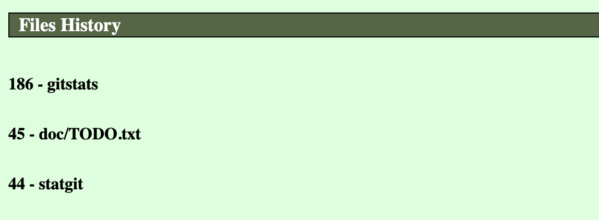
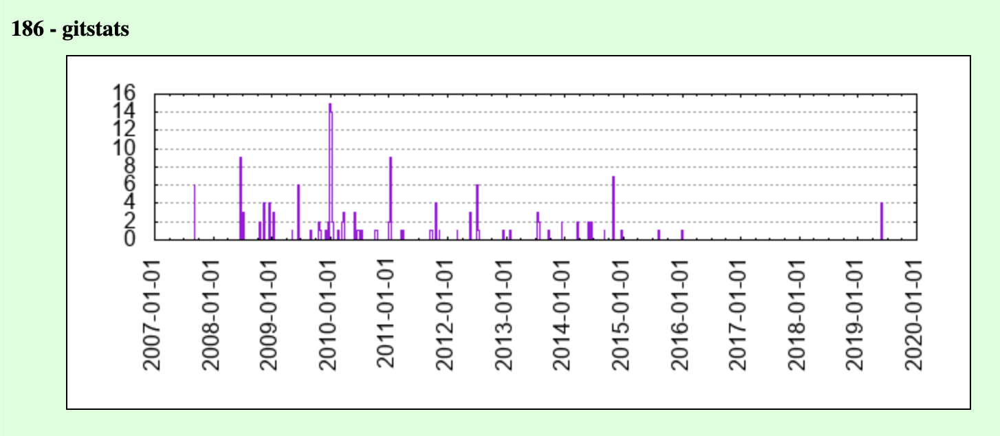
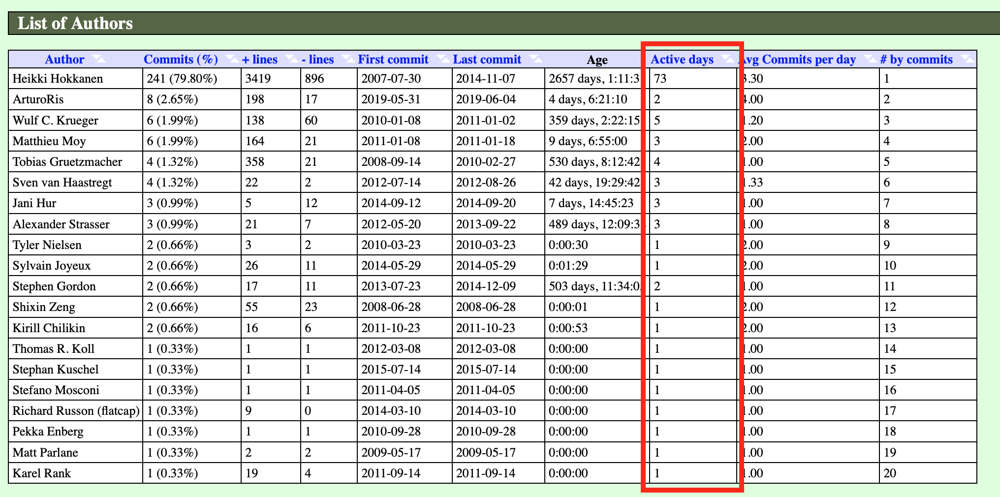

# gitstats
[git history statistics generator](http://gitstats.sourceforge.net/)

## Features added

### Files History

In file's page I added a section with a list of all files ranked per number of revisions 
(i.e how many commits have been done on that file).

You can set a threshold that is the minimum number of revision that a file has to have to be present in this list passing as parameter `-c min_commit_number=20`. 
The default is 20: only files with more than 20 commits will be shown.  
Moreover, clicking on the file, a graph of # of commits over time will be shown.

### Avg Commit per day for Author

In Authors' page, List of authors section, I added a new column to the table: Avg Commits per day calculated as # of commits / active days.

#### Fixed bug in Hour of Day table of Activity page

### Exclude folder option

I added the possibility to exclude a folder from the analysis.  
You just need to pass the folder as `exclude` parameter.  
(Note: I'm not 100%  that this works correctly)

Example: `./gitstats -c exclude=folder/to/exclude . stats/`